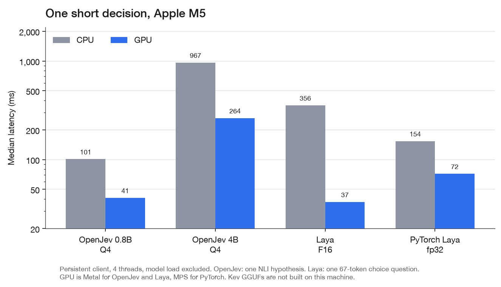

# openjev.cpp

MIT-licensed llama.cpp fork for [openjev](https://huggingface.co/AlexWortega/openjev), the Qwen3.5 NLI cross-encoder. Native three-class scoring, reranking, grading, final-token latents, image inputs, and bounded shared-prefix reuse.

**[Build and use openjev.cpp](OPENJEV.md)** | [Python client](openjev.py) | [Native CLI](tools/openjev/openjev.cpp) | [SystemOne HTTP](openjev_server.py)

## Why openjev.cpp

llama.cpp is a text generator. openjev is a classifier: last-token pooling, a 3-way `score` head, no chat template, no vocab projection. The GGUF does not carry an `lm_head`, so stock `llama-cli` / `llama-bench` cannot decode it unless you force embeddings mode.

On a single prompt the backbone is the same speed as llama.cpp. Against `llama-bench -embd 1` on upstream commit `6f41ac59e0a49a00483a316a22ada6b04edd2950` (Metal, Apple M5, F16, ubatch 512):

- 4B: 339 tok/s vs 336 tok/s
- 0.8B: about 1.6-1.8k tok/s either way

The win is the NLI request shape. Scoring several hypotheses that share a premise re-prefills each pair in llama.cpp embeddings. openjev prefills the common token prefix once, copies KV and recurrent state, and packs remaining suffixes into one decode (up to four pairs plus the prefix). Device context stays `2 * --ctx-size`.

Measured wall time for four long hypotheses (932 independent tokens, 248 with prefix cache):

| Model | llama.cpp-style independent | openjev prefix cache | vs llama.cpp |
| --- | ---: | ---: | ---: |
| 4B F16 | 2.8 s | 1.3 s | about 2.2x |
| 0.8B F16 | 0.52 s | 0.13-0.22 s | about 2-4x |

Three short hypotheses on 0.8B F16 dropped from 387 ms (one decode per suffix) to about 140 ms once suffixes share a graph. A 20-token pair is still ~20-60 ms on 0.8B and ~300 ms on 4B; short prompts are launch-bound on both stacks. Images skip prefix cache and run each pair independently through mtmd.

`--no-prefix-cache` is the independent-pair baseline. Numbers above exclude model load; the Python client keeps the process alive.

Laya (English ModernBERT-large plus the decision head, F16, Apple M5, 4 threads) against the PyTorch reference `RLAgent.system_one`. OpenJev is the persistent Python client. Medians of 8 runs after 2 warmups; model load excluded. CPU is built with libomp 23.1.1.

| Case | OpenJev CPU | PyTorch CPU | OpenJev Metal | PyTorch MPS |
| --- | ---: | ---: | ---: | ---: |
| Short, 1 question (67 tokens) | 356 ms | 154 ms | 37 ms | 72 ms |
| 512 tokens, 1 question | 1.17 s | 734 ms | 152 ms | 325 ms |
| Short, 8 questions (536 tokens) | 1.41 s | 724 ms | 165 ms | 336 ms |

Metal is about 2x PyTorch MPS on these requests. CPU is still slower than PyTorch CPU.

One short decision on the same machine, including the OpenJev Q4 models that are on disk. OpenJev times are one NLI hypothesis. Laya times are the 67-token choice question above.



| Model | CPU | GPU |
| --- | ---: | ---: |
| OpenJev 0.8B Q4 | 101 ms | 41 ms Metal |
| OpenJev 4B Q4 | 967 ms | 264 ms Metal |
| Laya F16 | 356 ms | 37 ms Metal |
| PyTorch Laya fp32 | 154 ms | 72 ms MPS |

Four hypotheses with prefix cache: OpenJev 0.8B Q4 is 295 ms CPU / 120 ms Metal, and OpenJev 4B Q4 is 1.37 s CPU / 777 ms Metal. Kev checkpoints are not converted here, so they are not on the chart.

---

# llama.cpp (upstream)


<div align="center">

<b>LLM inference in C/C++</b>

[](https://opensource.org/licenses/MIT)
[](https://github.com/ggml-org/llama.cpp/releases?q=tag:v0)
[](https://github.com/ggml-org/llama.cpp/releases?q=b)
[](https://github.com/ggml-org/llama.cpp/actions/workflows/server.yml)
[](https://github.com/ggml-org/llama.cpp/actions/workflows/docker.yml)
[](https://github.com/ggml-org/llama.cpp/actions/workflows/winget.yml)

[ggml](https://github.com/ggml-org/ggml) / [ops](https://github.com/ggml-org/llama.cpp/blob/master/docs/ops.md) / [maintainer PRs](https://github.com/ggml-org/llama.cpp/issues?q=is%3Apr%20is%3Aopen%20draft%3AFalse%20(author%3Argerganov%20OR%20author%3AKitaitiMakoto%20OR%20author%3Adanbev%20OR%20author%3Aaldehir%20OR%20author%3Amax-krasnyansky%20OR%20author%3ACISC%20OR%20author%3Aggerganov%20OR%20author%3Aam17an%20OR%20author%3Ajhen0409%20OR%20author%3Abartowski1182%20OR%20author%3Anikwen%20OR%20author%3Ahipudding%20OR%20author%3Aravi9%20OR%20author%3AServeurpersoCom%20OR%20author%3Apwilkin%20OR%20author%3Areeselevine%20OR%20author%3Angxson%20OR%20author%3Ajeffbolznv%20OR%20author%3Amarty1885%20OR%20author%3A0cc4m%20OR%20author%3ATitaniumtown%20OR%20author%3Aangt%20OR%20author%3AIMbackK%20OR%20author%3Aarthw%20OR%20author%3AJohannesGaessler%20OR%20author%3AORippler%20OR%20author%3Aruixiang63%20OR%20author%3Axctan%20OR%20author%3Aallozaur%20OR%20author%3Ayomaytk%20OR%20author%3Aaendk%20OR%20author%3Awine99%20OR%20author%3Agaugarg-nv%20OR%20author%3Ataronaeo%20OR%20author%3Aforforever73%20OR%20author%3Alhez%20OR%20author%3Anetrunnereve%20OR%20author%3Afairydreaming)%20sort%3Aupdated-desc) / [dev stats](https://github.com/ggml-org/llama.cpp-dev) / [lib llama API](https://github.com/ggml-org/llama.cpp/issues/9289) / [llama-server REST API](https://github.com/ggml-org/llama.cpp/issues/9291)

</div>

## Quick start

A few options to get `llama.cpp` installed on your machine:

- Visit https://llama.app and follow the instructions
- Run with Docker - see our [Docker documentation](docs/docker.md)
- Download pre-built binaries from the [releases page](https://github.com/ggml-org/llama.cpp/releases)
- Build from source by cloning this repository - check out [our build guide](docs/build.md)

Once installed:

```sh
# Download and run a model directly from Hugging Face
llama cli -hf ggml-org/Qwen3.5-0.8B-GGUF

# Launch OpenAI-compatible API server
llama serve -hf ggml-org/Qwen3.5-0.8B-GGUF
```

<table align="center">
    <tr>
        <td align="center" width=50%>
            
            <i>VLM session with <b>llama cli</b></i>
        </td>
        <td align="center">
            
            <i>Built-in web UI against <b>llama serve</b></i>
        </td>
    </tr>
<table>

## Description

The main goal of `llama.cpp` is to enable LLM (and VLM) inference with minimal setup and state-of-the-art performance on
a wide range of hardware - locally and in the cloud.

- Plain C/C++ implementation without any dependencies
- Apple silicon is a first-class citizen - optimized via ARM NEON, Accelerate and Metal frameworks
- AVX, AVX2, AVX512 and AMX support for x86 architectures
- RVV, ZVFH, ZFH, ZICBOP and ZIHINTPAUSE support for RISC-V architectures
- 1.5-bit, 2-bit, 3-bit, 4-bit, 5-bit, 6-bit, and 8-bit integer quantization for faster inference and reduced memory use
- Custom CUDA kernels for running LLMs on NVIDIA GPUs (support for AMD GPUs via HIP and Moore Threads GPUs via MUSA)
- Vulkan and SYCL backend support
- CPU+GPU hybrid inference to partially accelerate models larger than the total VRAM capacity

The `llama.cpp` project is build on top of the [ggml](https://github.com/ggml-org/ggml) library.

## Supported backends

| Backend | Target devices |
| --- | --- |
| [BLAS](docs/build.md#blas-build) | All |
| [BLIS](docs/backend/BLIS.md) | All |
| [CANN](docs/build.md#cann) | Ascend NPU |
| [CUDA](docs/build.md#cuda) | Nvidia GPU |
| [HIP](docs/build.md#hip) | AMD GPU |
| [Hexagon](docs/backend/snapdragon/README.md) | Snapdragon |
| [IBM zDNN](docs/backend/zDNN.md) | IBM Z & LinuxONE |
| [MUSA](docs/build.md#musa) | Moore Threads GPU |
| [Metal](docs/build.md#metal-build) | Apple Silicon |
| [OpenCL](docs/backend/OPENCL.md) | Adreno GPU |
| [OpenVINO [In Progress]](docs/backend/OPENVINO.md) | Intel CPUs, GPUs, and NPUs |
| [RPC](https://github.com/ggml-org/llama.cpp/tree/master/tools/rpc) | All |
| [SYCL](docs/backend/SYCL.md) | Intel GPU |
| [VirtGPU](docs/backend/VirtGPU.md) | VirtGPU APIR |
| [Vulkan](docs/build.md#vulkan) | GPU |
| [WebGPU](docs/build.md#webgpu) | All |
| [ZenDNN](docs/build.md#zendnn) | AMD CPU |

## Documentation

#### Tools

- [cli](tools/cli/README.md)
- [completion](tools/completion/README.md)
- [server](tools/server/README.md)
- [GBNF grammars](grammars/README.md)

#### Development

- [How to build](docs/build.md)
- [Running on Docker](docs/docker.md)
- [Build on Android](docs/android.md)
- [Multi-GPU usage](docs/multi-gpu.md)
- [Performance troubleshooting](docs/development/token_generation_performance_tips.md)
- [GGML tips & tricks](https://github.com/ggml-org/llama.cpp/wiki/GGML-Tips-&-Tricks)
- [XCFramework](docs/xcframework.md)
- [Completions](docs/completions.md)
- [Models](docs/models.md)
- [Release process](docs/release.md)

## Contributing

- Contributors can open PRs
- Collaborators will be invited based on contributions
- Maintainers can push to branches in the `llama.cpp` repo and merge PRs into the `master` branch
- Any help with managing issues, PRs and projects is very appreciated!
- Read the [CONTRIBUTING.md](CONTRIBUTING.md) for more information

## Acknowledgements

- [yhirose/cpp-httplib](https://github.com/yhirose/cpp-httplib) - Single-header HTTP server, used by `llama-server` - MIT license
- [nothings/stb](https://github.com/nothings/stb) - Single-header image format decoder, used by multimodal subsystem - Public domain
- [nlohmann/json](https://github.com/nlohmann/json) - Single-header JSON library, used by various tools/examples - MIT License
- [mackron/miniaudio](https://github.com/mackron/miniaudio) - Single-header audio format decoder, used by multimodal subsystem - Public domain
- [sheredom/subprocess.h](https://github.com/sheredom/subprocess.h) - Single-header process launching solution for C and C++ - Public domain
